# TP Final: Speak-In App

## Descripción General

Speak-In App es un sistema de gestión de cursos de idiomas desarrollado en **Laravel 12**, con **Laravel Breeze** para autenticación y **Tailwind CSS** para el diseño. Permite administrar alumnos, docentes, cursos, inscripciones, evaluaciones y archivos adjuntos, diferenciando funcionalidades según el rol del usuario (admin, coordinador, docente, alumno). La experiencia de usuario está completamente en español.

---
## Diseño

Está diseñado con la arquitectura MVC (Modelo-Vista-Controlador) y sigue buenas prácticas de **[Laravel](https://laravel.com/docs/12.x/installation)**( o eso intenta ._. ). Utiliza componentes Blade por defecto y customizados. Breeze facilita el uso de componentes reutilizables como inputs, dropdowns y botones.

---

## Herramientas y Librerías Utilizadas

- **Laravel 12**: Framework principal
- **Laravel Breeze**: Autenticación simple y rápida
- **Tailwind CSS**: Framework de estilos CSS
- **Blade Components**: Inputs, botones, navegación, etc.
- **Blade Lucide Icons**: Íconos SVG para Blade
- **Blade UI Kit**: Componentes de íconos
- **MySQL**: Base de datos
- **Seeder y Factory**: Poblar la base de datos
- **Youtube**: El Rincón de Isma, Dani Krossing, Laracast
- **Recursos web**: Stack Overflow, Medium, Kinsta, Solibeth.net, Flowbite, W3, Mozilla, Reddit

---

## Requisitos Funcionales

- **Roles y permisos:**
  - Solo administradores y coordinadores pueden crear, editar y eliminar usuarios, cursos y asignar docentes.
  - Solo docentes pueden ser asignados como profesores de cursos.
  - Los alumnos solo pueden inscribirse en cursos activos y hasta un máximo de 5 cursos activos.
- **Validaciones:**
  - Edad mínima de alumnos: 16 años.
  - Email y DNI únicos por usuario/alumno.
  - Mensajes de error claros y en español.
- **Evaluaciones y adjuntos:**
  - Los docentes pueden cargar evaluaciones y archivos adjuntos por curso.
- **Dashboard y navegación:**
  - Vistas diferenciadas por rol, navegación clara y mensajes de estado.

---

## Modelos y Entidades

- **User:** id, name, email, password, role, specialty, phone, address, active
- **Student:** id, first_name, last_name, dni, email, birth_date, phone, address, gender, active
- **Course:** id, title, description, start_date, end_date, status, modality, virtual_link, max_capacity, teacher_id
- **Enrollment:** id, student_id, course_id, enrollment_date, status, final_grade, attendance, notes, graded_by_teacher
- **Evaluation:** id, student_id, course_id, score, comments, created_at
- **Attachment:** id, course_id, title, file_url, type, uploaded_at

## Modelos

### User
- **Campos:** id, name, email, password, role, specialty, phone, address, active
- **Funcionalidades:**
  - Autenticación y roles (`admin`, `coordinator`, `professor`)
  - Si el usuario es profesor, tiene muchos cursos (`courses()`)

### Student
- **Campos:** id, first_name, last_name, dni, email, birth_date, phone, address, gender, active
- **Funcionalidades:**
  - Tiene muchas inscripciones (`enrollments()`)
  - Tiene muchas evaluaciones (`evaluations()`)

### Course
- **Campos:** id, title, description, start_date, end_date, status, modality, virtual_link, max_capacity, teacher_id
- **Funcionalidades:**
  - Pertenece a un profesor (`teacher()`)
  - Tiene muchas inscripciones (`enrollments()`)
  - Tiene muchas evaluaciones (`evaluations()`)
  - Tiene muchos archivos adjuntos (`attachments()`)

### Enrollment
- **Campos:** id, student_id, course_id, enrollment_date, status, final_grade, attendance, notes, graded_by_teacher
- **Funcionalidades:**
  - Pertenece a un estudiante (`student()`)
  - Pertenece a un curso (`course()`)

### Evaluation
- **Campos:** id, student_id, course_id, score, comments, created_at
- **Funcionalidades:**
  - Pertenece a un estudiante (`student()`)
  - Pertenece a un curso (`course()`)

### Attachment
- **Campos:** id, course_id, title, file_url, type, uploaded_at
- **Funcionalidades:**
  - Pertenece a un curso (`course()`)

### MODELO LÓGICO

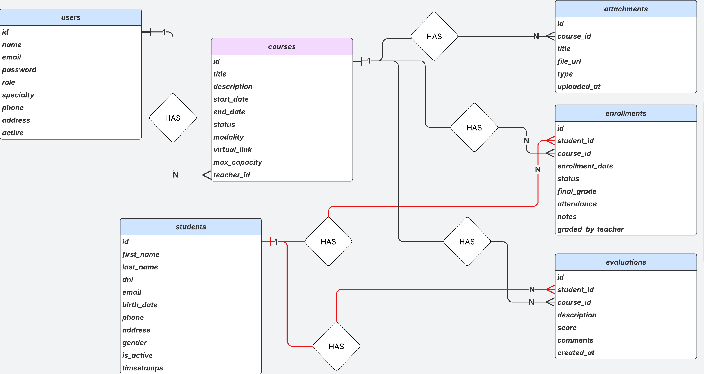

### DIAGRAMA ENTIDAD-RELACIÓN
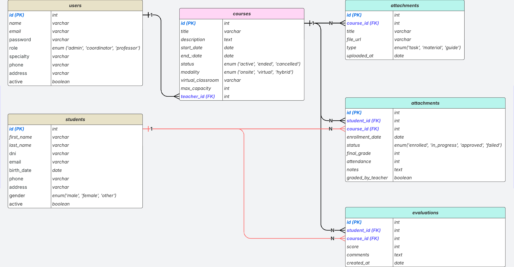

---

## Estructura de Carpetas

- **app/Http/Controllers/**: Lógica de negocio y validaciones
- **app/Models/**: Modelos Eloquent
- **database/migrations/**: Migraciones de la base de datos
- **database/seeders/**: Datos de prueba y validación de reglas
- **resources/views/**: Vistas Blade y componentes
- **routes/web.php**: Rutas principales

```plaintext
tp-final-speak-in-app/
├── app/
│   ├── Http/
│   │   ├── Controllers/
│   │   └── Middleware/
│   ├── Models/
├── bootstrap/
├── config/
├── database/
│   ├── migrations/
│   ├── seeders/
│   └── factories/
├── public/
│   └── build/
├── resources/
│   ├── views/
│   │   ├── components/
│   │   ├── dashboard/
│   │   ├── students/
│   │   ├── courses/
│   │   ├── enrollments/
│   │   ├── users/
│   │   ├── attachments/
│   │   └── evaluations/
│   ├── css/
│   └── js/
├── routes/
│   ├── web.php
│   └── console.php
├── storage/
├── tests/
├── vendor/
├── .env
├── artisan
├── composer.json
├── package.json
├── README.md
└── final_readme.md
```
---

## Instalación y Puesta en Marcha

1. Clonar el repositorio:
   ```bash
   git clone <url-del-repo>
   cd tp-final-speak-in-app
   ```
2. Instalar dependencias:
   ```bash
   composer install
   npm install
   npm run build
   ```
3. Configurar el archivo `.env`:
   - Copiar `.env.example` a `.env` y completar datos de conexión MySQL.
4. Migrar y poblar la base de datos:
   ```bash
   php artisan migrate --seed
   ```
5. Iniciar el servidor:
   ```bash
   php artisan serve
   ```
6. Acceder vía navegador a `http://localhost:8000`

---

### Comandos y paquetes utilizados en el desarrollo

#### Modelos, Controladores y Recursos
```bash
php artisan make:model User -mcr
php artisan make:model Student -mcr
php artisan make:model Course -mcr
php artisan make:model Enrollment -mcr
php artisan make:model Evaluation -mcr
php artisan make:model Attachment -mcr
```

#### Seeders y Factories
```bash
php artisan make:seeder UserSeeder
php artisan make:seeder StudentSeeder
php artisan make:seeder CourseSeeder
php artisan make:seeder EnrollmentSeeder
php artisan make:seeder EvaluationSeeder
php artisan make:seeder AttachmentSeeder
php artisan make:factory UserFactory
php artisan make:factory StudentFactory
```

#### Instalación de Breeze (autenticación)
```bash
composer require laravel/breeze --dev
php artisan breeze:install
npm install && npm run dev
```

#### Instalación de Blade UI Kit y Lucide Icons
```bash
composer require blade-ui-kit/blade-icons
composer require mallardduck/blade-lucide-icons
```

#### Instalación de idioma
```bash
composer require --dev laravel-lang/common
php artisan lang:add es en
```

#### Otros comandos útiles
```bash
php artisan migrate:fresh --seed   # Reinicia y repuebla la base de datos
php artisan route:clear
php artisan config:clear
php artisan cache:clear
npm run dev                        # Compila assets en modo desarrollo
npm run build                      # Compila assets para producción
```
---

## **IMPORTANTE ANTES DE COMENZAR!**
**- El Admin que gestiona todo es generado únicamente a través de seeder en el file database/seeders/AdminUserSeeder.php**
- Si quisieras cambiar los datos de ingreso, se debe modificar el AdminUserSeeder, si la base de datos se importadirectamente, las credenciales ya generadas son las que se encuentran allí. 

---

## Usuarios de Prueba

- **Admin:** admin@speakin.com / password
- **Coordinador:** coord@speakin.com / password
- **Docente:** teacher@speakin.com / password
- **Alumno:** student@speakin.com / password

* Usamos un middleware para redirigir a los usuarios según su rol al iniciar sesión.

---

## Notas y Recursos

- Framework: Laravel 12
- Autenticación: Breeze
- Estilos: Tailwind CSS
- Base de datos: MySQL
- Componentes Blade reutilizables
- Recursos: Stack Overflow, Medium, Kinsta, Flowbite, W3, Mozilla
- Web Icon: Ícono genérico extraido de [FlatIcon](https://www.flaticon.com/)
- Para cambiar el idioma de los componentes de Laravel (ej. paginate()) edita `resources/lang/es/pagination.php`.


---

## Personalización de Estilos

- **Tailwind CSS**: Configurado en `tailwind.config.js` con personalizaciones

---

## Configuración y Estructura: Modelos, Migraciones, Seeders y Middleware

### Modelos Eloquent
Todos los modelos principales (`User`, `Student`, `Course`, `Enrollment`, `Evaluation`, `Attachment`) están definidos en `app/Models/` y siguen buenas prácticas:
- Uso del trait `HasFactory` para compatibilidad con factories y seeders.
- Definición del array `$fillable` para asignación masiva.
- Relaciones Eloquent correctamente implementadas entre entidades (por ejemplo, `Student` tiene muchas `Enrollment` y `Evaluation`, `Course` pertenece a un `User` como profesor, etc.).

### Migraciones
Las migraciones definen la estructura de la base de datos alineada a la consigna:
- Los campos y enums están en inglés.
- Las relaciones entre tablas se establecen mediante claves foráneas.
- Las restricciones de unicidad y reglas de negocio se reflejan en los controladores y migraciones.

### Seeders y Factories
- El seeder principal (`DatabaseSeeder.php`) crea usuarios con roles (`admin`, `coordinator`, `professor`), estudiantes, cursos, inscripciones, evaluaciones y archivos adjuntos de prueba.
- Las factories (`UserFactory.php`, `StudentFactory.php`, etc.) permiten poblar la base de datos con datos realistas y variados para pruebas y desarrollo.

### Middleware de Roles
- Se implementó un middleware personalizado (`RoleMiddleware.php`) para restringir el acceso a rutas según el rol del usuario.
- El middleware se registra y se utiliza en las rutas con la sintaxis `role:admin,coordinator,professor`.

### Proceso de Inicialización
1. Ejecuta las migraciones y seeders:
   ```bash
   php artisan migrate:fresh --seed
   ```
2. El sistema queda listo para pruebas y desarrollo, con datos de ejemplo y control de acceso por roles.

---

## Estado Actual
- Migraciones, modelos y seeders completos y alineados a la consigna.
- Controladores CRUD implementados con validaciones y reglas de negocio.
- Middleware de roles funcionando en Laravel 12.
- Base de datos poblada y lista para desarrollo de vistas y lógica de negocio.

---

## Esquema de Capturas de Pantalla para Casos de Uso

A continuación se presenta un esquema para mostrar las capturas necesarias que evidencian el cumplimiento de los requerimientos de la consigna.

### 1. **Autenticación y Roles**
- Pantalla de login (UI en español)
- Dashboard para cada rol:
  - Administrador
  - Coordinador
  - Docente

### 2. **Operaciones CRUD**
- Alumnos: Listado, Crear, Editar, Ver, Eliminar
- Docentes: Listado, Crear, Editar, Ver, Eliminar
- Cursos: Listado, Crear, Editar, Ver, Eliminar
- Inscripciones: Listado, Crear, Editar, Ver, Eliminar
- Evaluaciones: Listado, Crear, Editar, Ver, Eliminar
- Archivos adjuntos: Listado, Crear, Editar, Ver, Eliminar

### 3. **Restricciones por Rol**
- Admin creando/editando/eliminando usuarios y cursos
- Coordinador registrando alumnos e inscripciones (sin acceso a gestión de usuarios/cursos)
- Docente visualizando solo sus cursos, inscripciones y evaluaciones (sin acceso a eliminar/editar entidades restringidas)

### 4. **Validaciones y Mensajes de Error**
- Intento de crear email/DNI duplicado (mostrar error)
- Intento de inscribir alumno en más de 5 cursos activos (mostrar error)
- Intento de asignar más de 3 cursos activos a un docente (mostrar error)
- Validación de formato de archivo adjunto (error por formato inválido)
- Curso asignado a docente inactivo (mostrar error)
- Curso excediendo cupo máximo (mostrar error)
- Curso sin alumnos al finalizar (mostrar error)

### 5. **UI/UX y Navegación**
- Barra de navegación principal (opciones según rol)
- Dashboard con métricas y accesos rápidos
- Paginación en listados
- Mensajes de estado y error en español

### 6. **Archivos Adjuntos y Evaluaciones**
- Carga de archivo adjunto (formatos válidos)
- Visualización de archivos adjuntos vinculados a cursos/evaluaciones
- Creación y visualización de evaluaciones para alumnos


---

1. Pantalla de Login

* 1.1 Pantalla inicial
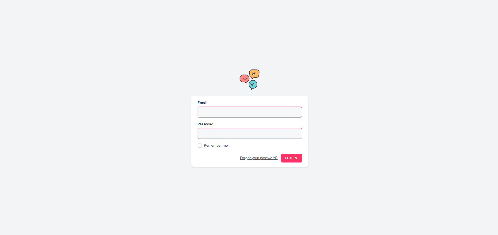

* 1.2 Validación de Login
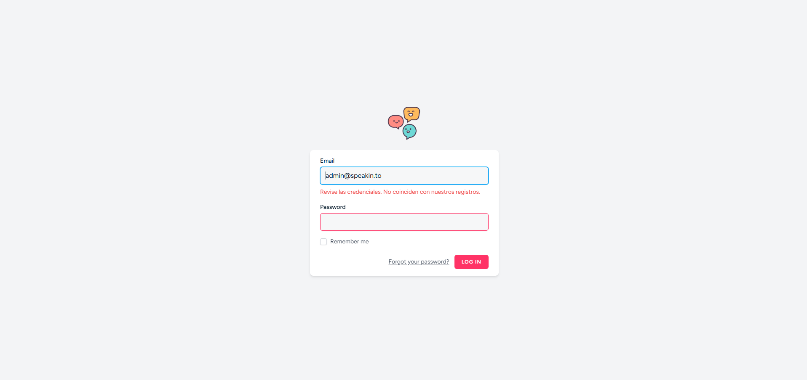

2. Dashboard

* 2.1 Dashboard Admin
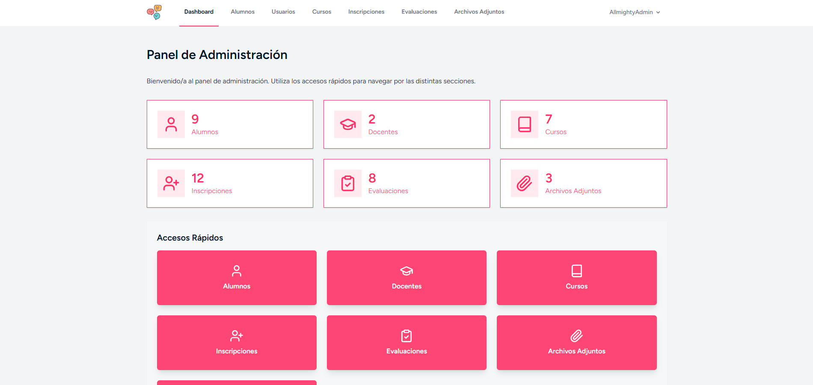

* 2.2 Dashboard Coordinador
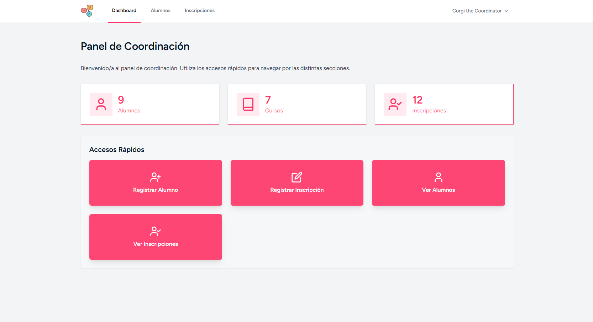

* 2.3 Dashboard Docente
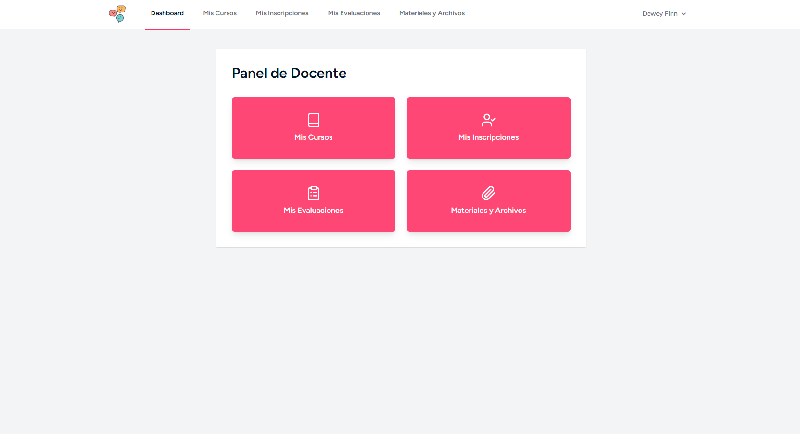

3. CRUD de Alumnos

* 3.1 Listado de Alumnos
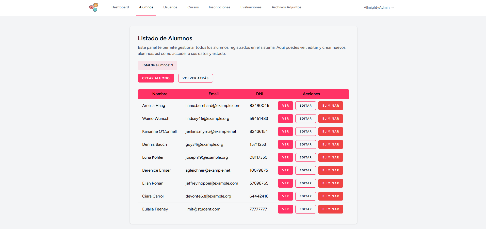

* 3.2 Crear Alumno
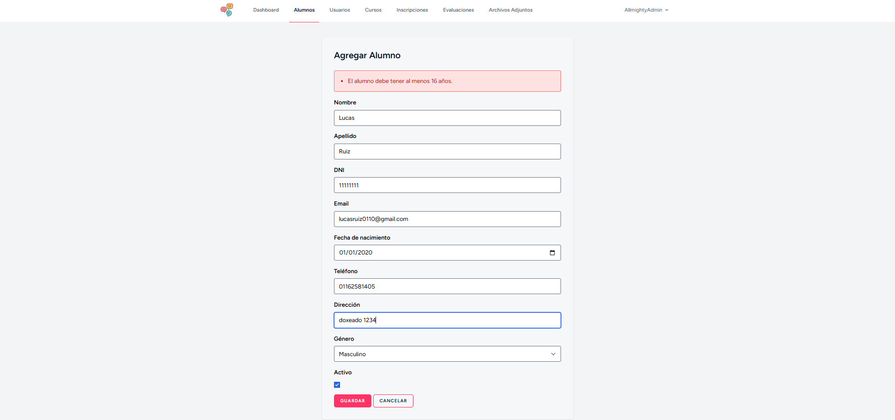
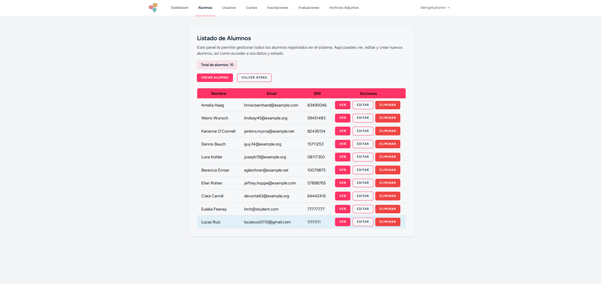

* 3.3 Editar Alumno
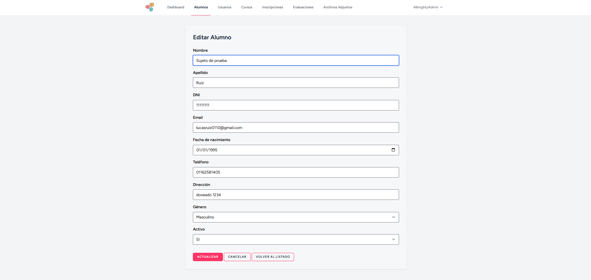

* 3.4 Ver Alumno
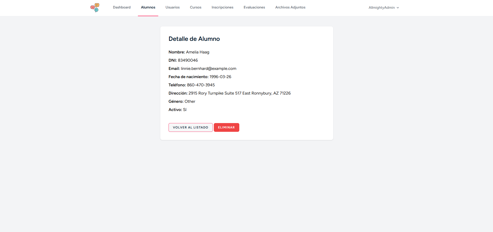

* 3.5 Eliminar Alumno
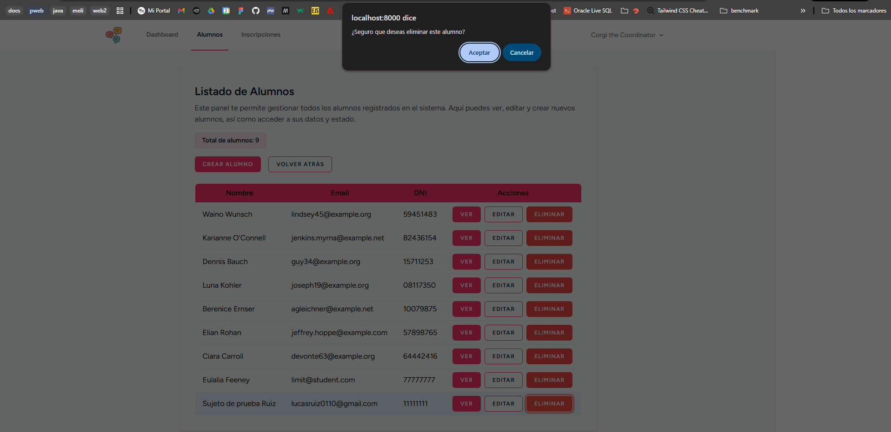


4. CRUD Attachments

* 4.1 Listado de Attachments
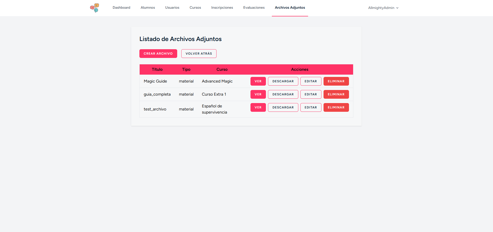

* 4.2 Crear Attachment
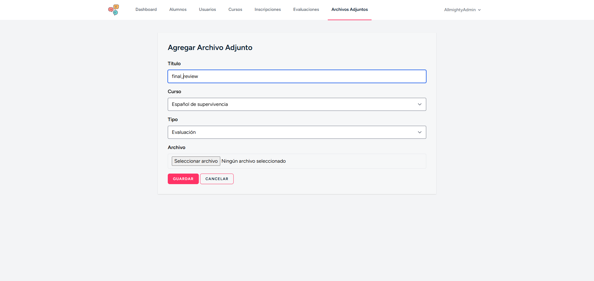
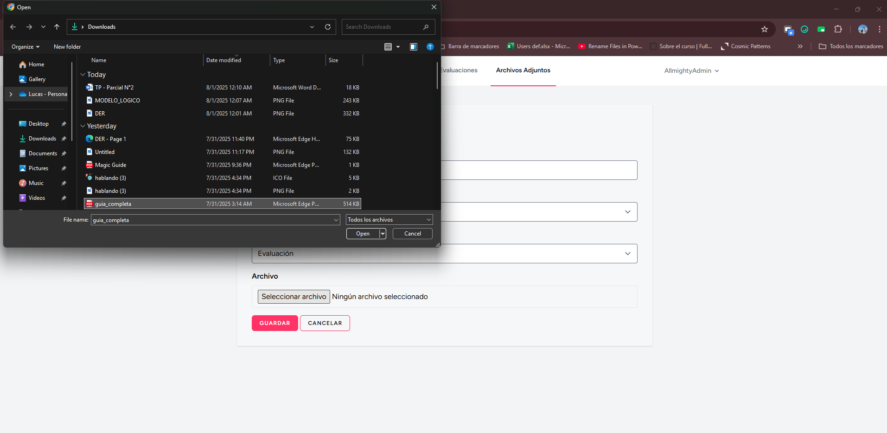
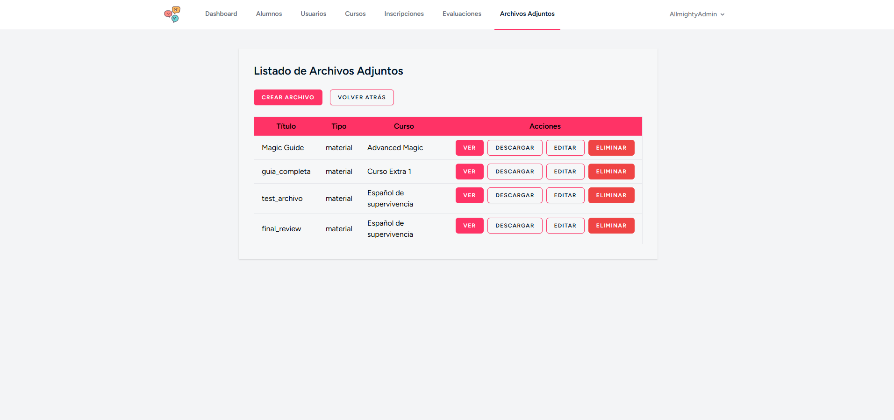

* 4.3 Editar Attachment
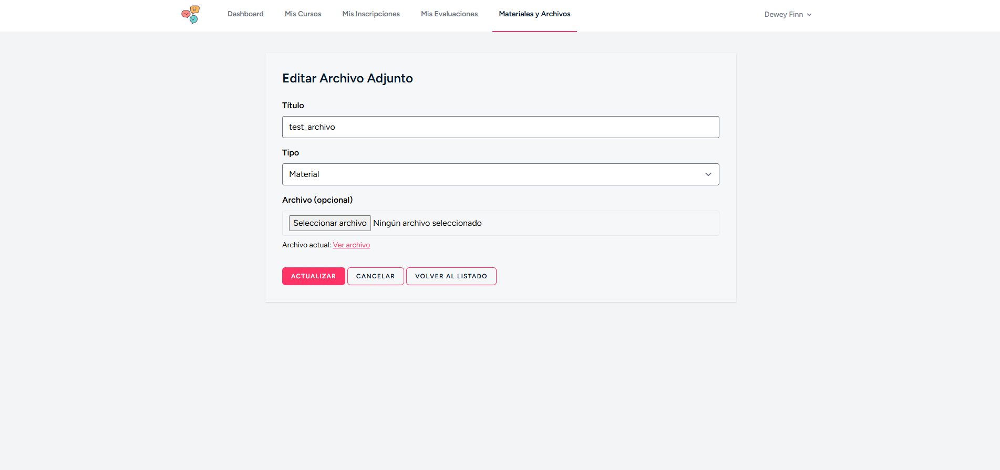

* 4.4 Ver Attachment
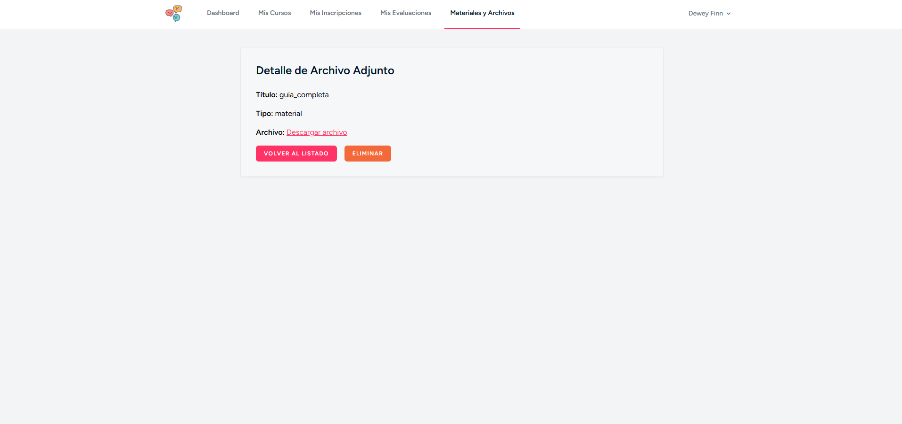

--- 

## Nota final
- Muchas gracias por tomarte el tiempo de revisar este proyecto, agregaré más capturas con casos de uso y funcionalidades en el futuro! 

